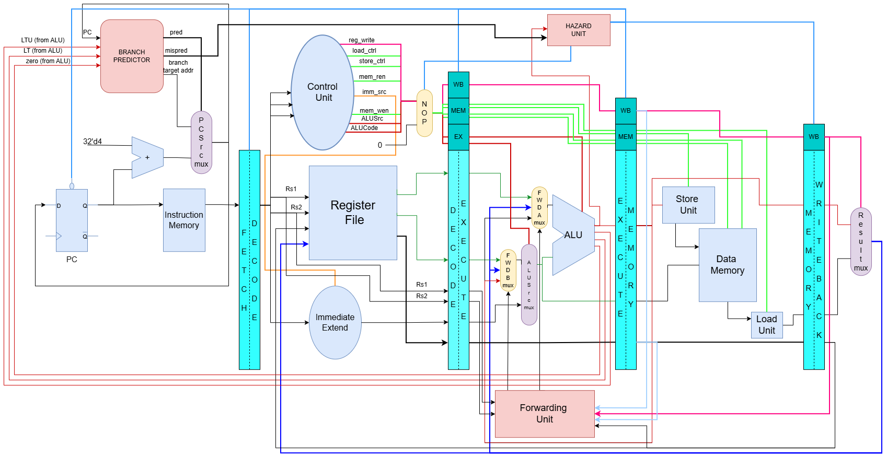

# 5-stage Pipelined RISCV Processor
This repository is an extension of the single cycle implementation at [RISCV-Single-Cycle-Processor](https://github.com/veerx2704/RISCV_Single_Cycle.git) and aims to optimize that design into a pipelined processor with 5 stages (Instruction Fetch / Decode / Execute / Memory Read/Write / Register Writeback).

## Design-Overview



### Supported-Instructions
| Instruction Type | Instruction supported |
|:------------------|:-----------------------|
|R-Type| ADD, SUB, AND, OR, XOR, SLT, SLTU, SLL, SRL, SRA |
|I-Type| ADDI, ANDI, ORI, XORI, SLTI, SLTUI, SLLI, SRLI, SRAI |
|I-Type (load)| LW, LB, LH, LBU, LHU |
|S-Type| SW, SB, SH |
|B-type| BEQ, BNE, BLT, BLTU |
|U-Type| LUI |
|J-Type| JAL, JALR | 

### File-Structure

```
Repository/
├── RISCV_PIPELINED.png
├── constraints
│   └── input_constraints.xdc
├── mem_ASIC ----------------------> Files developed for the purpose of synthesis through Yosys (Sky130 PDK)
│   ├── branch_gshare.sv
│   ├── data_mem.sv
│   ├── memory_bank_32_x_1024.sv
│   └── sram_memory_bank.sv
├── mem_FPGA ----------------------> Files developed for the purpose of synthesis through Vivado (Kintex-7 FPGA)
│   ├── branch_gshare.sv
│   └── data_mem.sv
├── memory_map.v ------------------> Mapping directive for yosys to identify memory blocks from the design
├── my_memlib.txt -----------------> Mapping directive for yosys to identify memory blocks from the design
├── pipelined_ext -----------------> Modules added for the purpose of pipelining the core
│   ├── branch_gshare -------------> Dynamic Branch Predictor (GShare predictor -> Branch Translation Buffer adding shortly)
│   │   ├── branch_gshare.sv
│   │   └── netlist.v
│   ├── decode_stage.sv
│   ├── execute_stage.sv
│   ├── fetch_stage.sv
│   ├── forward_unit.sv
│   ├── hazard_unit.sv
│   ├── memory_stage.sv
│   ├── riscv_pipelined.sv
│   └── writeback_stage.sv
├── single_cycle ----------------> Modules that remain common with the single cycle core (only for referencing pipelined core - for single cycle implementation, strictly refer Single-Cycle-Core Repository)
│   ├── ALU.sv
│   ├── PC_handler.sv
│   ├── PC_next.sv
│   ├── PC_target.sv
│   ├── Single_Cycle_Data_Path.sv
│   ├── adder.sv
│   ├── alu_decoder.sv
│   ├── branch_decoder.sv
│   ├── control_unit.sv
│   ├── imm_extend.sv
│   ├── inst_mem.sv
│   ├── load_computation.sv
│   ├── main_decoder.sv
│   ├── memory_bank_32_x_1024.sv
│   ├── reg_file.sv
│   ├── riscv_single_cycle.sv
│   ├── riscv_top.sv
│   └── store_computation.sv
└── README.md


```
### Design Specs
The design targets to achieve 100MHz operational frequency. 

The repository introduces the following new features - 
1. 5-stage pipeline                                                         **(WIP)**
2. Dynamic Branch Prediction                                                
3. Hazard Detection - To flush out pipeline when stalling is inevitable
4. Forward Unit - To control data forwarding
5. Exception Handling - To handle invalid instructions                      **(WIP)**
6. Development over 2 methods - Vivado (for FPGA implementation) and Yosys/OpenROAD/OpenSTA (for ASIC implmentation with SkyWater 130nm PDK).

This repository will have nearly the same design in both the approaches, with the difference being at memory access. FPGA based implementation will have BRAM based memory instantiation (2-D array in Verilog), while the ASIC based implementation will have SRAM macro (from PDK library).

The design is still in development stage, with completion targetted for September 2026
